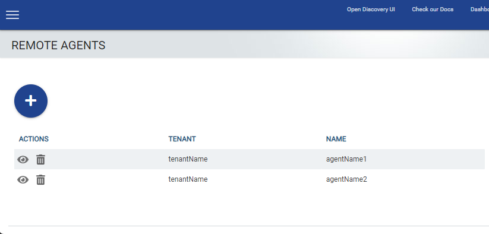
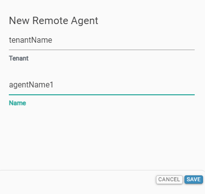
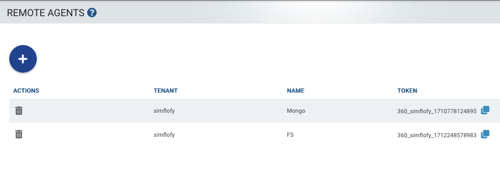
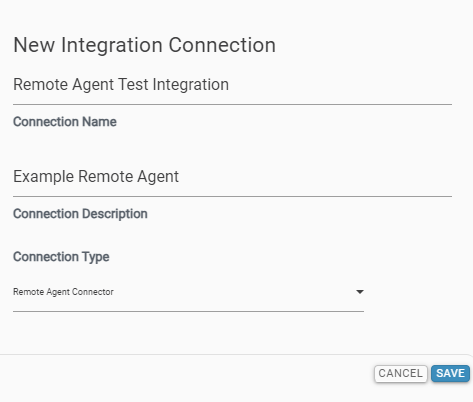
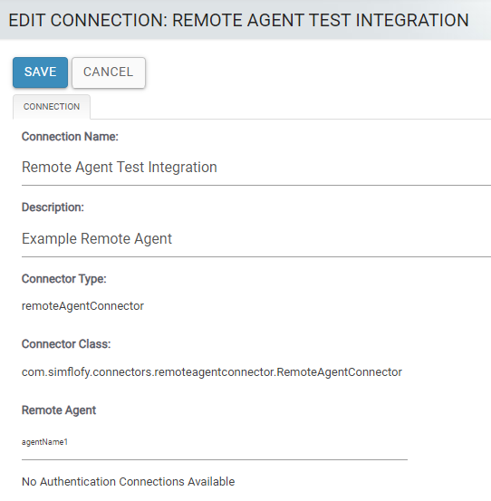
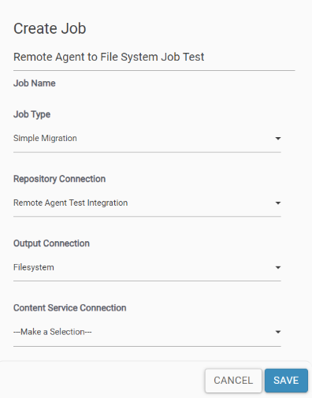
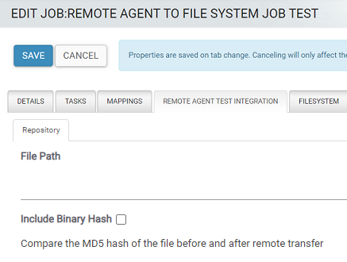
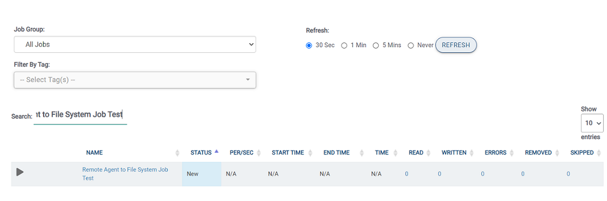

# remote-agent-example

The `remote-agent-example` is an Example of a Remote Agent. It shows how to use
the [SDK](https://central.sonatype.com/artifact/com.objective.threesixty/threesixty-sdk)
to connect with the 3Sixty Server.

## How to Use the SDK

1. Add the SDK as a Maven dependency in your project.

```     
      <dependency>
          <groupId>com.objective.threesixty</groupId>
          <artifactId>threesixty-sdk</artifactId>
          <version>1.0.2</version>
      </dependency> 
```

2. Add the below configuration in the *application.yaml* file.

- `server:`
    - `port:` Port of the 3Sixty server

- `remote-agent:`
    - `token:` This is the API token that is generated in the 3Sixty server.
      See [Creating an Agent Token](#step-1-create-an-agent)
    - `agent-name:` Name of the agent
    - `grpc-server:`
        - `host:` Host address of the 3Sixty server
        - `port:` Port of the 3Sixty gRPC server
        - `timeouts:`
            - `configure-connector-form-rpc:` Maximum wait time for saving job configurations
            - `share-document-metadata-rpc:` Maximum wait time for sending a single document's metadata
            - `share-documents-rpc:` Maximum wait time for sending the list of documents from the repository
            - `validate-agent-token-rpc:` Maximum wait time for validating remote agent tokens
    - `server-url:` REST URL to connect with the 3Sixty server
    - `ssl-config:`
        - `ca-certs:`
            - `password:` Password to the certificate authority
        - `enabled:` `false` to use plaintext, or `true` to use SSL

Contact the 3Sixty team to get the host, port and url.

3. In your application, scan for SDK beans and components. You can do this by using the `@ComponentScan` annotation in
   your Main class.
    - See the *Application.java* file for reference.
4. Implement the SDK's *ConnectorForm.java* interface.
    - See the *FileSystemConnectorForm.java* for reference.
5. Then implement the SDK'S *Reader.java* interface.
    - See the *FileSystemReader.java* for reference.

## How to configure the Connector

In the implementation of the `ConnectorForm.java` interface, you can configure the configuration as below

```    
@Override
public List<Field> getFields() {
    // File Path
    Field filePath = Field.newBuilder()
            .setLabel("File Path")
            .setId("filePath")
            .setTextField(TextField.newBuilder().build())
            .build();
    return List.of(filePath);
}
```

In the above code, we are configuring a **Text Field** to create a File Path in 3Sixty Server.

## Running the Remote Agent

### Requirements

- Java 17
- Maven 3.8

### Steps to Build and Run

1. Clone this project
2. Update the *application.yaml* as mentioned in [How to use the SDK](#how-to-use-the-sdk)
3. Open the project in any supported IDE (For example: IntelliJ IDEA, Eclipse etc.) and run the project from the IDE
4. If you do not have an IDE, run the following commands to create the JAR file:
   ```bash
   mvn clean
   mvn package

Then you can run the jar file using the command prompt `java –jar remote-agent-example.jar`

## Configuring a Remote Agent Job

### Step 1: Create an Agent:

1. Log into 3Sixty and navigate to `Admin -> Remote Agents`
   This Remote Agents page will list any existing Agents.

*Image 1: 3Sixty Remote Agent List*



2. Select the `blue plus` button to open the New Remote agent form
3. Enter the Agent name, and select `save`

*Image 2: Create New Remote Agent*



4. View the newly created remote agent generated by 3Sixty
5. Copy and paste the `Token` into the `remote-agent.token:` field in the *application.yaml* file. See Step 2
   in [How to Use the SDK](#how-to-use-the-sdk)

*Image 3: New Remote Agent with Token*



### Step 2: Create an Integration Connection

1. Go to `Connections -> Integration` in the left navigation menu
2. Click on the `blue plus` sign to create a new integration connection
3. Select `Remote Agent Connector` from the Connection Type dropdown
4. Click `Save` to create the new connection

*Image 4: New Remote Agent Integration Connection*



5. On the `Edit Connection` page select the Agent you created in [Step 1](#step-1-create-an-agent) from the Remote Agent
   dropdown
6. Click Save

*Image 5: Edit New Integration Connection*



### Step 3: Create a Job

After the token is generated, you can run the Remote Agent with the token to establish a connection with the Server.
Refer to the [Build and Run](#steps-to-build-and-run) section for instructions on how to run the remote agent.
Once the Remote Agent is running, you can begin creating Jobs.
In this example we will be moving files from the Remote Agent connector to a File System folder.

1. Go to `Integration -> List Jobs` on the navigation menu
2. Click the Blue Plus button to create a new job
3. View the Edit Job Page
4. Select the Integration Connection `Remote Agent Test Integration` you created
   in [Step 2](#step-2-create-an-integration-connection)
5. Select File System for the Output Connection

*Image 6: Create an Example Job*



6. Go to the Remote Agent Configuration Tab and enter the File Path configuration that you configured in your Agent

*Image 7: File Path Configuration*



7. Go to the File System Configuration tab and enter the destination File System directory

8. Go to `Integration -> Run and Monitor Jobs`
9. Locate your integration job and select run. You can use the search field to filter for the job name

3Sixty will copy the files from your Remote Agent to your file system directory

*Image 8: Run New Remote Agent Job*



## Configuring SSL

By default, SSL is enabled on the Server. So, if you need to run without SSL, please update the
property(`3sixty.grpc.server.ssl`)
to `false` in the 3Sixty application.

Then, in the *application.yaml*, update `remote-agent.ssl-config.enabled` to false.

### cacerts

If you have JAVA in your machine, cacerts will already be there. All of our certificates will be in cacerts.
You can import the certificate in cacerts using the command line or using GUI.
We recommend using Keystore Explorer (https://keystore-explorer.org). Keystone Explorer should open as below.


From the above screen, select `Open the CA Certificate KeyStore`, It should show all the certificates in cacerts.

### Configuring Certificate in the Server

Ideally, the client should get the certificate from the Certificate Authority. In the server, you will need two files to
enable SSL.

1. Server Certificate
2. Server Private Key

Both of them should be in .pem format (for example, *server-cert.pem* and *server-key.pem*).

#### Server Certificate

1. cacerts password should be the same as the property `3sixty.grpc.server.cacerts.password`. By default, the value
   is `changeit`.
   If your cacerts password is different, update this property.
2. Import your server certificate in cacerts and alias it with the value in the
   property`3sixty.grpc.server.cacerts.cert.alias`.
   By Default its value is `grpc-objective-server`. You can alias the certificate with the default value unless you
   changed the property.

#### Server Private Key

- The private key should be in `.pem` format, and should be named as `server-key.pem`.
- Create a `cert` folder in the Tomcat `webapps` directory and copy the `server-key.pem` file into
  `{catalina.home}/webapps/cert/server-key.pem`, where `catalina.home` refers to the Tomcat home directory.

### Configuring Certificate in the Client

1. cacerts password should be same as property `remote-agent.ssl-config.ca-certs.password`. By default, its value
   is `changeit`.
   If your cacerts password is different, update this property.
2. Import the client certificate in cacerts and alias it with any suitable name.

## License

MIT License.